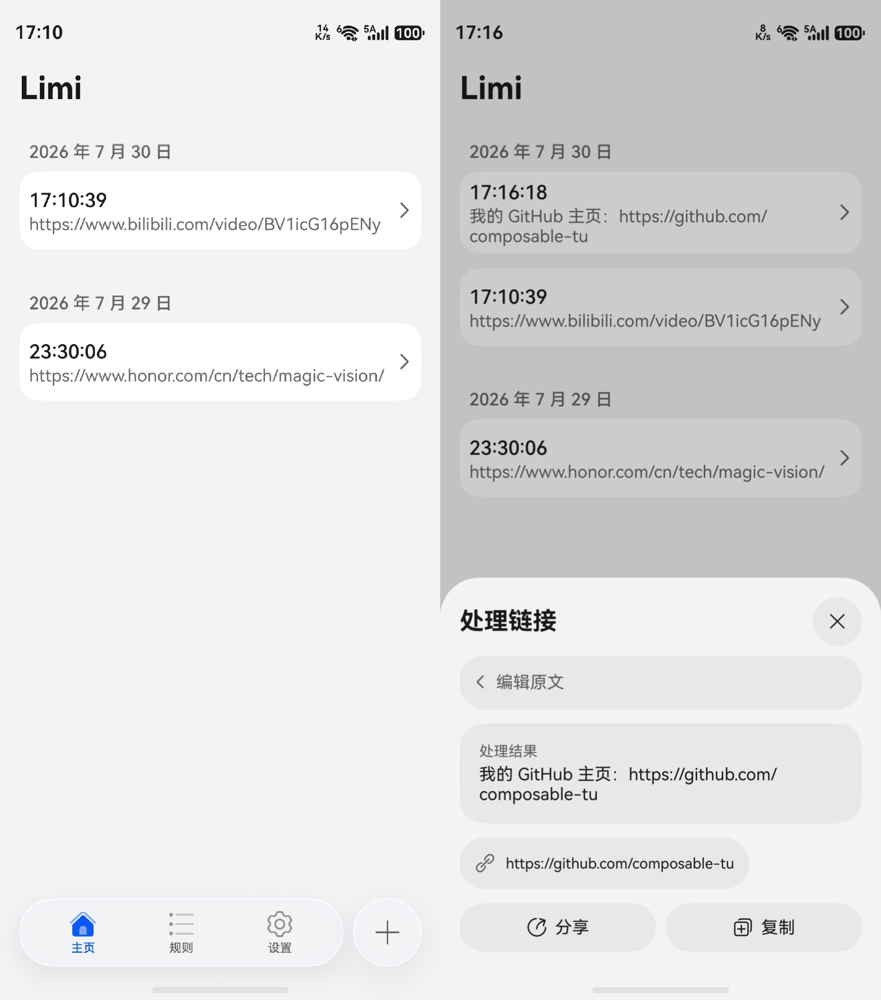

# Limi

面向政企事业单位人员控制涉外链场景隐私外溢风险的 HarmonyOS 应用

> [!NOTE]
> 该应用尚在开发中。

## 演示截图

## 致谢

本项目的云端规则来源于以下项目：

### Mozilla Firefox Query Parameter Stripping

- 规则来源：https://firefox.settings.services.mozilla.com/v1/buckets/main/collections/query-stripping/records
- Mozilla Public License 2.0：https://www.mozilla.org/MPL/2.0/

### Brave Browser

- 规则来源：https://github.com/brave/adblock-lists
- Mozilla Public License 2.0：https://www.mozilla.org/MPL/2.0/

### ClearURLs.xyz

- 规则来源：https://rules1.clearurls.xyz/data.minify.json
- 项目主页：https://clearurls.xyz
- GNU Lesser General Public License v3.0：https://www.gnu.org/licenses/lgpl-3.0.html
